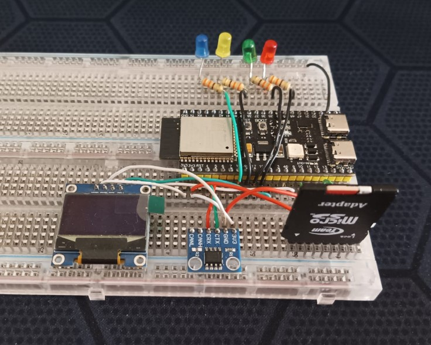
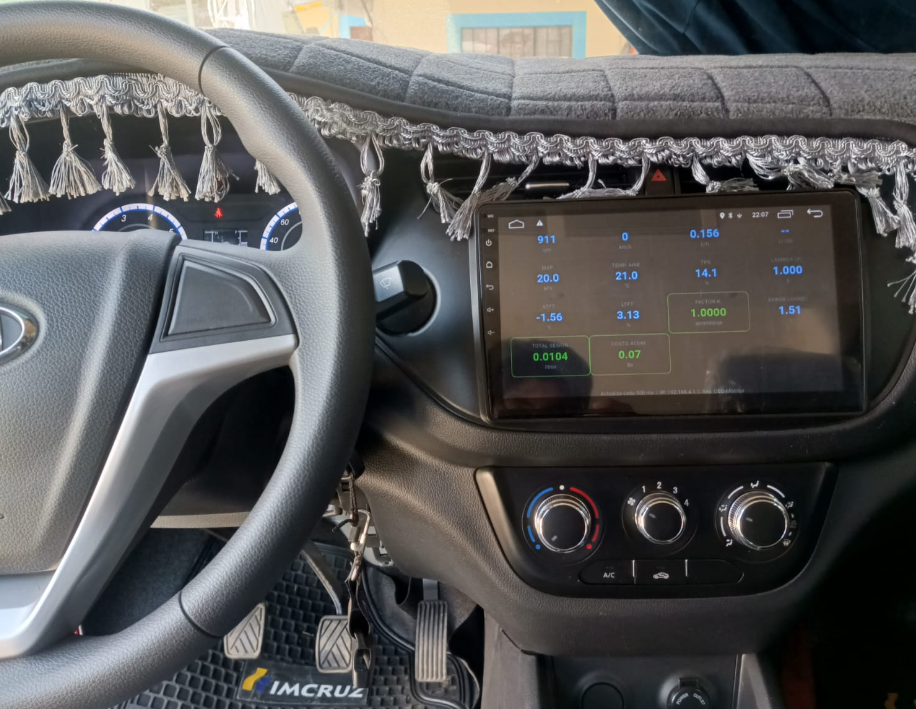
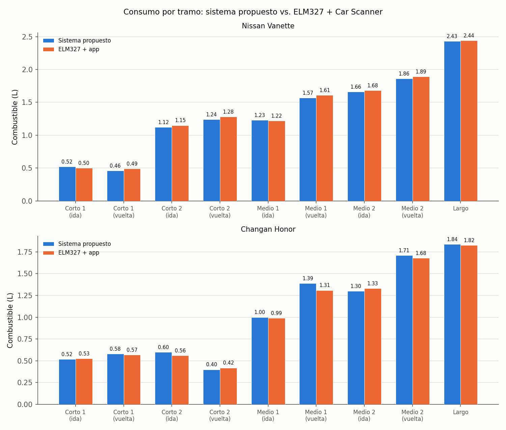

# Monitoreo del consumo de combustible — La Paz, Bolivia

Sistema embebido de monitoreo de consumo de combustible orientado a la mejora de la eficiencia energética en el transporte público urbano de La Paz. Se conecta al puerto OBD-II del vehículo, estima el consumo en tiempo real mediante el método Speed-Density, lo registra en una tarjeta microSD y lo muestra en una pantalla OLED y en un panel web propio (sin depender de internet ni de un servidor de terceros).

Proyecto de grado — Carrera de Ingeniería Mecánica y Electromecánica (Ingeniería Mecatrónica), Facultad de Ingeniería, **Universidad Mayor de San Andrés (UMSA)**, La Paz, Bolivia.

<p align="center">
  
</p>

## ¿Qué hace?

- Lee parámetros del motor (RPM, MAP/MAF, IAT, velocidad, ajustes de combustible) directamente del bus CAN mediante el protocolo OBD-II (ISO 15765-4).
- Estima el consumo instantáneo con el modelo Speed-Density, calibrado y validado en campo sobre dos vehículos reales (Nissan Vanette y Changan Honor).
- Registra un historial completo por viaje en microSD (CSV).
- Sirve un panel web propio vía WiFi (SoftAP del ESP32-S3) con datos en vivo por WebSocket — funciona dentro del vehículo sin necesitar conexión a internet.

<p align="center">
  
</p>

## Resultados de validación

Sobre nueve tramos de ruta real (dos vehículos, aforo de tanque lleno como referencia):

| Métrica (vs. ELM327 + Car Scanner) | Valor |
|---|---|
| RMSE | 0,0312 L |
| MAE | 0,0262 L |
| MAPE | 2,75 % |
| R² | 0,9971 |

<p align="center">
  
</p>

Detalle completo de la metodología, las pruebas y las métricas (incluida la validación dinámica contra un sensor MAF real y el análisis de concordancia de Bland-Altman) en el Capítulo 4 de la tesis.

## Estructura del repositorio

```
CAP1-CAP6/    Capítulos de la tesis (LaTeX)
APENDICE/     Apéndices
GLOSARIO/     Glosario de términos técnicos
main.tex      Documento raíz (compila con pdflatex + bibtex)
main.pdf      Tesis compilada

CODIGOS/
  esp32s3_obd2_speeddensity/   Firmware de producción (PlatformIO)
  can_bench_tool/              Benchmark de latencia CAN (ESP32-S3)
  *.py                         Scripts de calibración, validación y generación de figuras

Images/       Figuras, fotos del prototipo y capturas del panel web
DATASHEET/    Hojas de datos de los componentes usados
```

## Firmware

Basado en ESP32-S3 (FreeRTOS, controlador TWAI nativo). Se compila por vehículo con PlatformIO:

```
cd CODIGOS/esp32s3_obd2_speeddensity
pio run -e vanette     # o -e changan
pio run -e vanette -t upload
```

Cada entorno define en tiempo de compilación la cilindrada y demás constantes propias del vehículo (`config.h`).

## Autor

**Cristian Erick Calle Ali** — Universidad Mayor de San Andrés
Tutor: Ing. Eloy Cristian Sarabia Yapuchura
